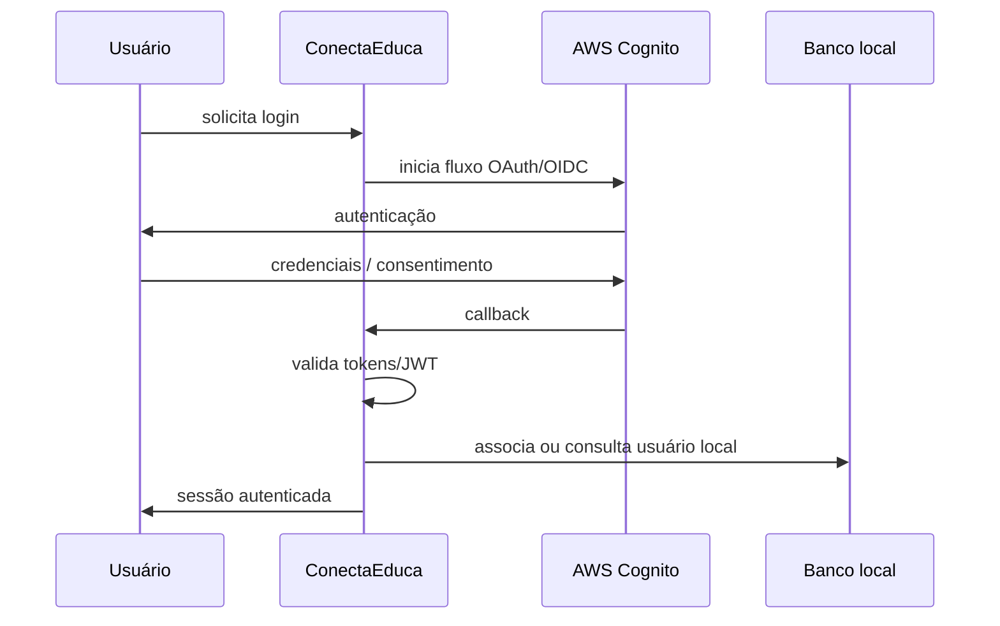

# ConectaEduca — versão AWS Cognito


Versão histórica do ConectaEduca desenvolvida para a disciplina **Segurança e Privacidade Web**.

> Esta branch é mantida para rastreabilidade acadêmica. O desenvolvimento atual do projeto ocorre na `main`, reutilizada e evoluída na disciplina **Experiência Criativa 8 — Criando soluções com Cibersegurança by Design no Ciberespaço**.

---

## Preservação histórica

A versão originalmente entregue com AWS Cognito está preservada em dois níveis:

| Referência | Finalidade |
|---|---|
| `seguranca-privacidade-web-cognito-final-2026-08-22` | snapshot imutável do estado original da versão Cognito |
| `legacy/seguranca-privacidade-web-cognito` | branch histórica navegável e documentada |

A tag permanece apontando para o commit original da antiga `main`. Este README é um commit documental posterior na branch histórica e **não altera o snapshot da entrega**.

---

## Visão geral

Nesta versão, o ConectaEduca é uma aplicação web acadêmica em PHP para oportunidades educacionais com autenticação integrada ao **Amazon Cognito**.

A implementação contém componentes específicos para o fluxo Cognito, incluindo:

- cliente OAuth para Cognito;
- verificação de JWT emitido pelo provedor;
- callback de autenticação;
- associação do usuário autenticado ao domínio local da aplicação;
- controles de autorização por papel;
- CSRF, sessões seguras e rate limiting;
- criptografia híbrida;
- auditoria;
- testes de configuração e comportamento de autenticação.

Arquivos representativos dessa arquitetura incluem:

```text
src/Security/CognitoOAuthClient.php
src/Security/CognitoJwtVerifier.php
src/Service/CognitoUserService.php
public/callback.php
tests/Integration/CognitoConfigTest.php
tests/Unit/Security/CognitoAutocadastroGroupTest.php
```

---

## Fluxo de autenticação



O Cognito atua como provedor de identidade; as regras de aplicação e autorização continuam sendo responsabilidade do ConectaEduca.

---

## Controles de segurança estudados

A versão da disciplina Segurança e Privacidade Web foi usada para trabalhar controles como:

- autenticação delegada;
- validação de JWT;
- autorização e proteção de rotas;
- CSRF;
- rate limiting;
- sessões seguras;
- validação de entrada;
- encoding de saída;
- mitigação de SQL Injection e XSS;
- criptografia híbrida;
- auditoria;
- análise de dependências;
- requisitos e testes orientados a OWASP/ASVS.

O diretório `docs/evidencias/` preserva evidências acadêmicas relacionadas a autenticação, bloqueio de rotas, PHPUnit, Composer e testes de segurança.

---

## Dependências características desta versão

O `composer.json` histórico inclui, entre outras dependências:

```text
aws/aws-sdk-php
pragmarx/google2fa
phpmailer/phpmailer
phpseclib/phpseclib
vlucas/phpdotenv
phpunit/phpunit
```

A presença do AWS SDK e das classes Cognito é específica desta linha acadêmica e **não representa a arquitetura atual da `main`**.

---

## Configuração

O arquivo `.env.example` histórico documenta variáveis relacionadas a:

- banco de dados;
- SMTP;
- chaves criptográficas;
- região e User Pool Cognito;
- Client ID/secret;
- domínio Cognito;
- redirect/logout URIs;
- credenciais AWS.

Nenhum valor real deve ser commitado.

```text
.env
chaves privadas
client secrets
AWS access keys
tokens
```

devem permanecer fora do controle de versão.

---

## Estrutura relevante

```text
conectaeduca/
├── public/
│   ├── login.php
│   ├── callback.php
│   └── ...
├── src/
│   ├── Security/
│   │   ├── CognitoOAuthClient.php
│   │   └── CognitoJwtVerifier.php
│   ├── Service/
│   │   └── CognitoUserService.php
│   └── ...
├── tests/
├── docs/
│   └── evidencias/
├── sql/
├── composer.json
└── README.md
```

---

## Relação com a versão atual

A reutilização do projeto para Experiência Criativa 8 alterou a fronteira de confiança.

```text
Segurança e Privacidade Web
AWS Cognito
     |
     v
autenticação delegada externa
```

passou a ser:

```text
Experiência Criativa 8
autenticação local + RBAC + MFA
     |
     v
infraestrutura própria em VMs
WAF + OpenBao + Ferret + Wazuh + Bacula + pfSense
```

A mudança não apaga a primeira implementação. Ela permite comparar duas decisões arquiteturais diferentes aplicadas ao mesmo domínio de aplicação.

---

## Reprodução histórica

Para estudar esta versão:

```bash
git switch legacy/seguranca-privacidade-web-cognito
composer install
vendor/bin/phpunit --testdox
```

A autenticação Cognito somente funciona se o ambiente possuir uma configuração AWS/Cognito própria e válida. Os valores reais usados durante a atividade não fazem parte do repositório.

Para consultar exatamente o snapshot da entrega original:

```bash
git switch --detach seguranca-privacidade-web-cognito-final-2026-08-22
```

---

## Aviso de uso

Esta branch é um **artefato acadêmico histórico**, não a linha de desenvolvimento atual e não uma configuração de produção.

Para a arquitetura atual de Cibersegurança by Design, consulte a branch `main`.
