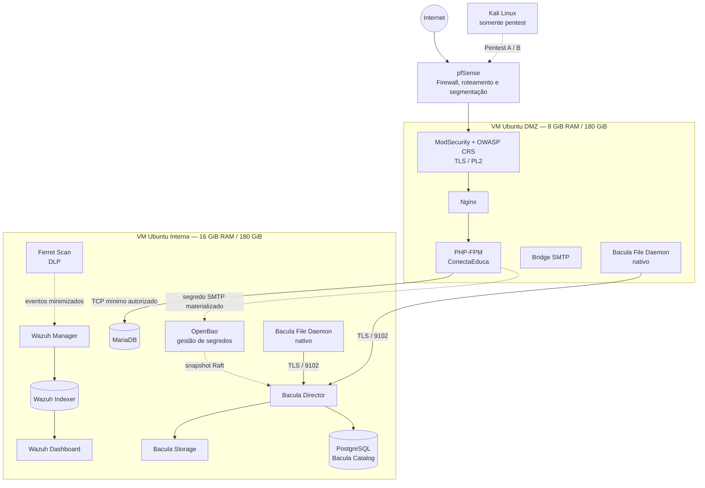

# ConectaEduca

[](https://github.com/andrea-kozicki/conectaeduca/actions/workflows/phpunit.yml)


Aplicação web acadêmica em PHP para divulgação e gestão de oportunidades educacionais, evoluída como laboratório de **Cibersegurança by Design**.

> **Disciplina atual:** Experiência Criativa 8 — *Criando soluções com Cibersegurança by Design no Ciberespaço*.

A versão atualmente mantida na `main` substitui a autenticação AWS Cognito da etapa acadêmica anterior por autenticação local, RBAC, MFA e controles de infraestrutura locais. A versão Cognito permanece preservada para rastreabilidade histórica.

---

## Visão geral

O ConectaEduca reúne uma aplicação PHP e uma arquitetura de defesa em profundidade preparada para implantação em duas VMs Ubuntu segmentadas por pfSense.

A aplicação contempla:

- autenticação local e autorização por papéis (`usuario`, `empresa` e `admin`);
- MFA e códigos de recuperação;
- recuperação segura de senha por SMTP;
- proteção CSRF, sessões seguras e rate limiting;
- validação de entrada e encoding de saída;
- criptografia híbrida com AES-256-GCM e RSA-OAEP;
- auditoria de eventos de autenticação e autorização;
- cadastro, consulta, favoritos e inscrições em oportunidades educacionais.

A infraestrutura acrescenta controles preventivos, detectivos e de recuperação: WAF, SIEM, DLP, YARA, gestão de segredos e backup verificável.

---

## Contexto acadêmico e evolução

O projeto nasceu na disciplina **Segurança e Privacidade Web**, quando a autenticação era integrada ao **AWS Cognito**.

Para **Experiência Criativa 8**, o sistema foi reaproveitado e evoluído para uma arquitetura local de cibersegurança, adequada ao laboratório com VMs próprias e segmentação de rede.

| Linha acadêmica | Referência no Git |
|---|---|
| Segurança e Privacidade Web — versão AWS Cognito | `legacy/seguranca-privacidade-web-cognito` |
| Snapshot original da versão Cognito | `seguranca-privacidade-web-cognito-final-2026-08-22` |
| Experiência Criativa 8 — arquitetura local / Security by Design | `main` |

A tag histórica permanece como fotografia do estado original. A branch histórica pode receber documentação contextual sem alterar esse snapshot.

---

## Arquitetura alvo



Não existe rede Docker atravessando as VMs. A comunicação entre DMZ e rede interna ocorre por TCP normal, sujeita às regras de infraestrutura e do pfSense.

O Twingate permanece fora do baseline operacional até a conclusão do **Pentest A sem Zero Trust**.

---

## Componentes de segurança

| Camada | Componente | Papel |
|---|---|---|
| Aplicação | Autenticação local + RBAC | separação de privilégios entre usuário, empresa e administrador |
| Aplicação | MFA | segunda etapa de autenticação e recuperação controlada |
| Aplicação | CSRF / sessão / rate limit | redução de abuso de sessão e autenticação |
| Aplicação | Criptografia híbrida | proteção de dados sensíveis com AES-256-GCM + RSA-OAEP |
| Perímetro web | ModSecurity + OWASP CRS | WAF antes do Nginx/PHP |
| Segredos | OpenBao | custódia e entrega controlada de secrets |
| DLP | Ferret Scan | detecção de conteúdo sensível e emissão de eventos minimizados |
| SIEM | Wazuh | correlação, observabilidade e regras de segurança |
| Anti-APT | YARA + Wazuh FIM | varredura de arquivos modificados e alerta |
| Backup | Bacula | backup/restore com File Daemons nativos nas VMs |
| Rede | pfSense | segmentação, roteamento e política entre zonas |
| Zero Trust | Twingate | etapa posterior ao primeiro pentest |

### OpenBao e Bacula

O OpenBao usa storage Raft. O backup não copia o volume bruto: uma AppRole de mínimo privilégio acessa somente `sys/storage/raft/snapshot`, e o snapshot lógico entra no fluxo Bacula.

O checkpoint final já comprovou backup, perda controlada, restore e igualdade SHA-256 entre o snapshot original e o restaurado.

Consulte:

- `deploy/interna/openbao/INTEGRACAO-BACULA-RAFT.md`
- `scripts/evidencias/checkpoint_bacula_openbao_raft_final.sh`

### DLP e observabilidade

O Ferret mantém relatórios brutos fora do SIEM e produz eventos minimizados por allowlist para o Wazuh.

Consulte:

- `deploy/interna/ferret/README.md`
- `deploy/interna/ferret/CONTRATO-EVENTOS-DLP.md`
- `deploy/interna/wazuh/INTEGRACAO-FERRET-DLP.md`

### YARA / anti-APT

A integração FIM → Active Response → YARA → alerta já está preparada e versionada. A ativação real do agente, FIM e YARA foi deliberadamente reservada para demonstração em aula.

Consulte:

- `deploy/interna/wazuh/INTEGRACAO-YARA-ANTIAPT.md`

---

## Gestão de segredos

Segredos reais **não pertencem ao Git nem aos pacotes de handoff**.

A arquitetura separa:

1. **segredos da aplicação**, como SMTP, materializados de forma controlada;
2. **segredos internos de infraestrutura**, armazenados em `.runtime/` com permissões restritas;
3. **credenciais efêmeras**, usadas somente durante uma operação e depois revogadas;
4. **material de custódia**, como shares Shamir do OpenBao, mantido fora do repositório.

Exemplos de material que nunca deve ser commitado:

```text
.env
.runtime/
RoleID / SecretID reais
root token do OpenBao
unseal shares
senhas MariaDB/Bacula/Wazuh
chaves privadas
certificados privados de runtime
```

Use `.env.example` apenas como contrato de configuração.

---

## Estrutura do repositório

```text
conectaeduca/
├── public/                  # entrypoints HTTP e assets públicos
├── src/
│   ├── Controller/
│   ├── Middleware/
│   ├── Model/
│   ├── Repository/
│   ├── Security/
│   ├── Service/
│   └── View/
├── tests/                   # PHPUnit
├── sql/                     # schema, migrations e seeds
├── deploy/
│   ├── dmz/                 # WAF, Nginx, PHP, SMTP e FD da DMZ
│   ├── interna/             # MariaDB, OpenBao, Ferret, Wazuh e Bacula
│   └── lab/                 # recursos exclusivos do laboratório
├── docs/                    # requisitos e artefatos de segurança
├── scripts/
│   ├── bootstrap/
│   ├── evidencias/
│   ├── handoff/
│   ├── implantacao/
│   └── recuperacao/
├── composer.json
├── phpunit.xml
└── README.md
```

---

## Desenvolvimento e testes

### Dependências PHP

```bash
composer install
```

O `composer.json` exige PHP 8.5 e extensões usadas pela aplicação. A política do Composer bloqueia advisories e pacotes abandonados conforme o contrato atual.

### Testes automatizados

```bash
vendor/bin/phpunit --testdox
```

O workflow `.github/workflows/phpunit.yml` também executa:

- validação do Composer;
- instalação reprodutível de dependências;
- lint PHP;
- listagem e execução dos testes PHPUnit.

### Checkpoint pré-handoff

```bash
bash scripts/evidencias/checkpoint_pre_handoff_2_1.sh
```

O checkpoint agrega readiness de OpenBao/Bacula, YARA/anti-APT e Bacula FD para as VMs.

---

## Implantação

A arquitetura final prevê:

- **pfSense** dedicado;
- **VM Ubuntu DMZ:** 8 GiB RAM / 180 GiB;
- **VM Ubuntu interna:** 16 GiB RAM / 180 GiB;
- **Kali Linux:** utilizado somente para os testes de intrusão.

Os containers e Compose são entregues pelo repositório; endereçamento, regras do pfSense, DNS, certificados reais e políticas de host são responsabilidades da fase de implantação.

Documentos principais:

- `deploy/ARQUITETURA-VMs.md`
- `deploy/CONTRATO-IMPLANTACAO.md`
- `deploy/IMAGENS-VALIDADAS.md`

---

## Estado da entrega EC8

O baseline local atingiu o checkpoint:

```text
READY_TO_FREEZE=SIM
```

Principais blocos concluídos ou preparados:

- aplicação local/RBAC;
- containerização DMZ e rede interna;
- WAF/TLS;
- MariaDB;
- OpenBao;
- SMTP;
- Ferret DLP;
- Wazuh core;
- YARA/anti-APT preparado;
- Bacula core;
- Bacula FD nativo preparado para as VMs;
- snapshot OpenBao Raft integrado e restaurado pelo Bacula.

### Próximas etapas

1. freeze e handoff final;
2. geração de artefatos reproduzíveis para DMZ e rede interna;
3. integração de release com GitHub Actions, SBOM e checksums;
4. implantação nas VMs Ubuntu;
5. ativação demonstrável de Wazuh Agent/FIM/YARA;
6. configuração final do pfSense;
7. Pentest A sem Zero Trust;
8. ativação do Twingate;
9. Pentest B com Zero Trust;
10. consolidação das evidências e documentação final.

---

## CI/CD e supply chain

O repositório já possui CI para PHPUnit na `main`.

A evolução planejada da pipeline de release é reutilizar os mesmos scripts de handoff local para:

```text
checkout
  -> validações
  -> SAST/dependency scanning
  -> build/scan das imagens
  -> SBOM
  -> handoff DMZ + interna
  -> SHA256SUMS
  -> artifacts
```

A pipeline de release não fará parte do runtime das VMs; ela produzirá artefatos de implantação verificáveis.

---

## Aviso de uso

Este é um projeto **acadêmico e de laboratório**. A arquitetura prioriza experimentação segura, rastreabilidade e demonstração de controles de cibersegurança.

Não trate configurações de laboratório, certificados de teste ou exemplos de credenciais como parâmetros adequados a um ambiente de produção.

---

## Autoria e finalidade

ConectaEduca é utilizado como projeto acadêmico para estudo aplicado de desenvolvimento web seguro, arquitetura defensiva, DevSecOps e Cibersegurança by Design.
