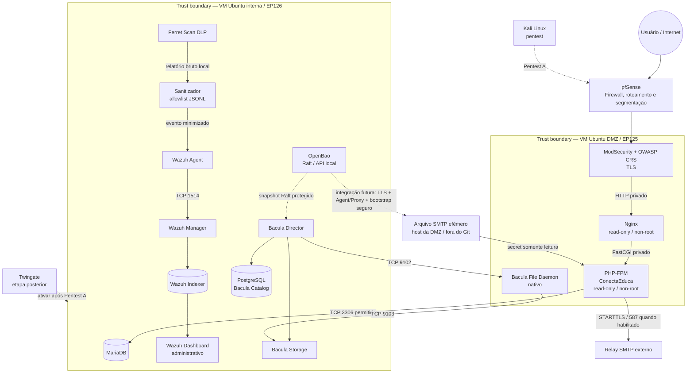

# ConectaEduca

[](https://github.com/andrea-kozicki/conectaeduca/actions/workflows/phpunit.yml)
[](https://github.com/andrea-kozicki/conectaeduca/actions/workflows/semgrep.yml)


Aplicação web acadêmica em PHP para divulgação e gestão de oportunidades educacionais, evoluída como laboratório de **Cibersegurança by Design**, defesa em profundidade e DevSecOps.

> **Disciplina atual:** Experiência Criativa 8 — *Criando soluções com Cibersegurança by Design no Ciberespaço*.

A `main` representa a arquitetura local atual. A autenticação AWS Cognito da etapa acadêmica anterior permanece preservada separadamente em `legacy/seguranca-privacidade-web-cognito`, sem ser misturada ao baseline atual.

---

## Estado atual em uma frase

O projeto já ultrapassou a fase de desenho: aplicação, containers, DMZ, rede interna, WAF, banco, OpenBao, Ferret, Wazuh e mecanismos de recuperação foram construídos e levados às VMs; Wazuh Agent/FIM/YARA foi validado operacionalmente; PHP-FPM e Nginx receberam hardening adicional pós-implantação. Permanecem como trabalhos principais a consolidação documental das evidências de rede, a reconciliação do Ferret, DAST/pentest e a etapa posterior de Zero Trust.

---

## Evolução do trabalho, testes e resultados

| Período | Evolução realizada | Testes/evidências | Resultado observado |
|---|---|---|---|
| mai–jun/2026 | versão acadêmica original com AWS Cognito e base MVC/segurança | testes de perfis e segurança da fase anterior | baseline histórico preservado em branch/tag próprias |
| 15–17/08 | autenticação local, RBAC, MFA TOTP, recovery codes e rate limiting persistente | PHPUnit, testes HTTP 401/403/419/429, checkpoints de autenticação | autenticação local passou a ser suficiente para substituir Cognito no escopo atual |
| 18–19/08 | Wazuh central, retenção, portabilidade de containers e OpenBao | checkpoints de Wazuh, Compose, imagens, healthchecks e portabilidade | núcleo de observabilidade e cofre preparados sem incorporar secrets ao Git |
| 20–21/08 | SMTP seguro, Ferret DLP e integração sanitizada com Wazuh | testes de SMTP, Ferret e `wazuh-logtest` sobre eventos minimizados | conteúdo bruto do DLP permaneceu fora do SIEM; somente contrato JSONL sanitizado foi aceito |
| 22/08 | Bacula, restore, snapshot Raft OpenBao, YARA e triagem de CVEs | backup/restore sintético, SHA-256, Trivy, Semgrep e análise contextual de CVEs | recuperabilidade deixou de ser apenas requisito; findings passaram a gerar correção ou risco residual documentado |
| 23/08 | GitHub Actions/Semgrep, runbooks de VMs, pfSense, Suricata e freeze pré-VMs | gates de CI, checkpoints de rede e handoff | repositório tornou-se fonte declarativa da implantação; Twingate foi conscientemente adiado |
| 27/08 | recuperação da EP126 | kit cifrado externo, Git bundle/freeze e snapshot Hyper-V | VM interna passou a ter três camadas de recuperação independentes documentadas |
| 01–02/09 | phpseclib 4, atualizações de dependências e Wazuh/YARA nas VMs | `composer validate`, audit, PHPUnit; agentes EP125/EP126; FIM → Active Response → YARA | 119 testes / 351 assertions registrados nos merges; agentes permaneceram Active em 1514 e enrollment 1515 foi fechado após bootstrap |
| 03–04/09 | hardening adicional do runtime PHP-FPM e Nginx + correções Semgrep | build/checkpoints, healthchecks, SAST, comparação de configuração | PHP e Nginx passaram a usar filesystem read-only, capabilities removidas, limites de PIDs e tmpfs controlados |
| 04/09 | testes de segmentação entre EP125 e EP126 | conectividade TCP positiva e negativa entre zonas | somente fluxos funcionais selecionados atravessaram; portas administrativas permaneceram bloqueadas entre zonas no teste observado |

A evolução detalhada e a relação entre decisão, teste, resultado e pendência estão em `docs/EVOLUCAO-ARQUITETURA-EC8.md`.

---

## Arquitetura operacional



### Princípios que o desenho preserva

- não existe rede Docker atravessando VMs;
- WAF é o ponto de entrada web, não Nginx/PHP diretamente;
- DMZ → interna usa allowlist de fluxos;
- OpenBao não é exposto à DMZ no baseline atual;
- o PHP consome o segredo SMTP por arquivo runtime fora do Git; a integração OpenBao EP126 → DMZ não está habilitada enquanto não houver TLS, Agent/Proxy ou workload identity e bootstrap seguro;
- Ferret não envia relatório bruto ao Wazuh;
- Director inicia o controle do File Daemon em TCP/9102; o FD envia dados ao Storage em TCP/9103;
- Twingate permanece fora do baseline até o Pentest A.

---

## Estado por controle

| Controle | Estado atual | Teste/resultado relevante | Próximo passo |
|---|---|---|---|
| autenticação local/RBAC | **validado** | respostas 401/403 por estado e papel; eventos de auditoria | manter regressão PHPUnit/HTTP |
| MFA | **validado** | senha não conclui login sem segunda etapa; recovery codes implementados | manter testes de replay/recuperação |
| CSRF | **validado** | POST mutável sem token retorna 419 | manter cobertura |
| rate limiting | **validado** | bloqueio e evento específico após limite | revalidar no DAST |
| WAF | **operacional** | tráfego legítimo + probes XSS/SQLi/path traversal exercitados no laboratório | repetir DAST nas VMs |
| PHP-FPM | **hardening pós-VMs na main** | runtime Alpine minimal; read-only; `cap_drop=ALL`; PIDs/tmpfs | reconciliar runtime implantado com o novo freeze |
| Nginx | **hardening pós-VMs na main** | non-root; read-only; `cap_drop=ALL`; PIDs/tmpfs | reconciliar runtime implantado com o novo freeze |
| MariaDB | **operacional na EP126** | healthcheck e bind restrito; triagem Trivy contextualizada | manter backup/restore e reavaliar imagem |
| OpenBao | **operacional na EP126** | initialized/unsealed/active; snapshot Raft restaurado via Bacula | manter API local; TLS somente se houver requisito entre zonas |
| Ferret DLP | **operacional, com drift a reconciliar** | pipeline DLP e sanitização validados; `main` ainda fixa 2.2.1 | conferir runtime 2.4.3 e promover por PR próprio se validado |
| Wazuh central | **operacional** | Manager/Indexer/Dashboard e configtests aprovados | consolidar telemetria remanescente |
| Wazuh Agent/FIM/YARA | **validado nas VMs** | EP125/EP126 Active em 1514; FIM → YARA → regra 110211 nível 12 | ampliar ruleset apenas com evidência |
| enrollment Wazuh | **fechado após bootstrap** | publicação host TCP/1515 removida após agentes registrados | reabrir somente em operação controlada de enrollment |
| Bacula | **implementado e restore validado em laboratório** | backup/restore + SHA-256; snapshot Raft OpenBao restaurado | consolidar evidência end-to-end pós-VM se necessária |
| recuperação EP126 | **validada** | Git/freeze + kit cifrado + snapshot Hyper-V | repetir apenas quando houver novo freeze significativo |
| pfSense/segmentação | **operacional com evidência parcial** | testes entre EP125/EP126 confirmaram allowlist funcional e bloqueio de portas administrativas | consolidar export/evidência possível sem depender de privilégio admin |
| Suricata | **incremento do pfSense** | deve entrar apenas após baseline de rede; documentação separa fase base de IDS | não declarar operacional sem checkpoint |
| Twingate | **deliberadamente adiado** | nenhum runtime deve entrar antes do Pentest A | Pentest A → Twingate → Pentest B |
| NTP | **dependência institucional em acompanhamento** | serviço ativo, mas relógio ainda não sincronizado nos diagnósticos | aguardar suporte; não alterar configuração institucional |

---

## Segurança de aplicação e dados

A aplicação contempla:

- autenticação local por papéis `usuario`, `empresa` e `admin`;
- MFA e códigos de recuperação;
- recuperação segura de senha por SMTP;
- CSRF;
- sessão segura;
- rate limiting;
- validação server-side e encoding de saída;
- criptografia híbrida AES-256-GCM + RSA-OAEP;
- auditoria de autenticação e autorização.

Segredos reais não pertencem ao Git, handoff ou relatórios. Material de runtime permanece em `.runtime`, tmpfs ou custódia externa, conforme o componente.

---

## Estrutura do repositório

```text
conectaeduca/
├── public/                  # entrypoints HTTP e assets públicos
├── src/                     # aplicação, domínio e controles de segurança
├── tests/                   # PHPUnit
├── sql/                     # schema, migrations e seeds
├── deploy/
│   ├── dmz/                 # WAF, Nginx, PHP, SMTP e Bacula FD da DMZ
│   ├── interna/             # MariaDB, OpenBao, Ferret, Wazuh e Bacula
│   ├── pfsense/             # matrizes, runbooks e checkpoints do perímetro
│   ├── vms/                 # implantação e identificação das VMs
│   └── lab/                 # recursos exclusivos do laboratório
├── docs/                    # threat model, requisitos, DFD e evidências
├── scripts/                 # bootstrap, evidências, handoff, implantação e recuperação
├── .github/workflows/       # PHPUnit e Semgrep
├── composer.json
├── phpunit.xml
└── README.md
```

## Desenvolvimento e validação local

O workflow de PHPUnit da `main` usa PHP 8.5 e Composer 2. Para reproduzir localmente os principais gates sem executar a implantação:

```bash
composer validate --strict --no-check-publish
composer audit --locked --no-interaction
composer install --no-interaction --prefer-dist --no-progress
composer check-platform-reqs
python3 scripts/evidencias/verificar_segredos_estaticos.py
git ls-files -z '*.php' | xargs -0 -r -n1 php -l
vendor/bin/phpunit --testdox
```

O SAST é executado separadamente pelo workflow `.github/workflows/semgrep.yml`.

Os scripts de evidência e seus contratos de uso estão documentados em `scripts/evidencias/README.md`. Arquivos como `.env.test.local`, `.runtime/`, credenciais e saídas específicas do ambiente permanecem fora do Git.

## Implantação e runbooks

A implantação não deve ser reconstruída a partir de exemplos soltos no README. As fontes operacionais são:

- `deploy/CONTRATO-IMPLANTACAO.md`;
- `deploy/ARQUITETURA-VMs.md`;
- `deploy/vms/README.md`;
- `deploy/pfsense/README.md`;
- READMEs específicos de Wazuh, Ferret, OpenBao e Bacula;
- `scripts/evidencias/README.md`.

A autoria de código e mudanças de configuração ocorre no repositório de desenvolvimento; as VMs são tratadas como runtime/implantação e validadas por checkpoints e evidências.

---

## DevSecOps, CI e supply chain

A `main` possui CI para:

- PHPUnit/lint/Composer;
- Semgrep SAST.

O projeto também usa, conforme o estágio:

- `composer audit`;
- Dependabot;
- pinagem de Actions por SHA;
- Trivy em imagens;
- triagem contextual de CVEs;
- checksums e handoff reproduzível.

O uso de SAST/SCA/scan de imagens não é ornamental: o histórico registra findings tratados, configuração endurecida e decisões de risco documentadas antes e depois da implantação.

A pipeline de release completa com SBOM, build/scan de imagens e publicação automática de handoffs continua sendo evolução planejada; ela não deve ser confundida com os checks de CI que já existem hoje.

---

## Recuperação e resiliência

O Bacula adota:

- File Daemons nativos nas VMs;
- Director/Storage/Catalog na rede interna;
- MariaDB por dump consistente;
- OpenBao por snapshot Raft;
- FileSets por allowlist;
- restore-test como critério de aceite.

A recuperação da EP126 também foi documentada com três camadas independentes:

1. GitHub + freeze;
2. kit cifrado externo;
3. snapshot Hyper-V.

O risco residual permanece explícito: enquanto Bacula Storage compartilhar o mesmo domínio físico da VM interna, perda total dessa VM/disco não é coberta pelo próprio Storage local.

---

## Testes que ainda faltam ou precisam de consolidação

1. reconciliar Ferret 2.4.3 observado em runtime com a baseline Git 2.2.1;
2. consolidar evidência final de segmentação/pfSense compatível com os privilégios disponíveis;
3. confirmar DLP ponta a ponta via Wazuh Agent, se ainda não houver evidência fechada;
4. executar OWASP ZAP/DAST dedicado nas VMs;
5. executar Pentest A sem Zero Trust;
6. ativar Twingate;
7. executar Pentest B;
8. consolidar relatório e evidências finais;
9. avaliar pipeline de release com SBOM/handoff automatizado.

---

## Documentação principal

- `docs/EVOLUCAO-ARQUITETURA-EC8.md` — evolução, testes, resultados e pendências;
- `docs/dfd.md` — fluxos de dados e trust boundaries;
- `docs/stride.md` — threat model;
- `docs/requisitos-seguranca-asvs.md` — requisitos ASVS;
- `docs/matriz-owasp-cwe-cve.md` — riscos, fraquezas, CVEs e controles;
- `docs/plano-testes.md` — plano reproduzível de validação;
- `deploy/ARQUITETURA-VMs.md` — posicionamento dos serviços;
- `deploy/pfsense/` — perímetro e segmentação;
- `deploy/interna/wazuh/` — SIEM/FIM/YARA;
- `deploy/interna/bacula/` — backup e recuperação;
- `docs/evidencias/` — evidências sanitizadas versionadas.

---

## Aviso de uso

Este é um projeto **acadêmico e de laboratório**. A arquitetura prioriza experimentação segura, rastreabilidade, validação por evidências e demonstração de controles de cibersegurança.

Configurações, certificados e parâmetros do laboratório não devem ser tratados automaticamente como parâmetros adequados a produção.
