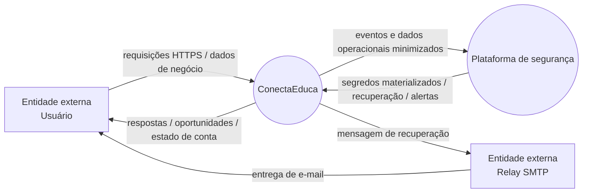
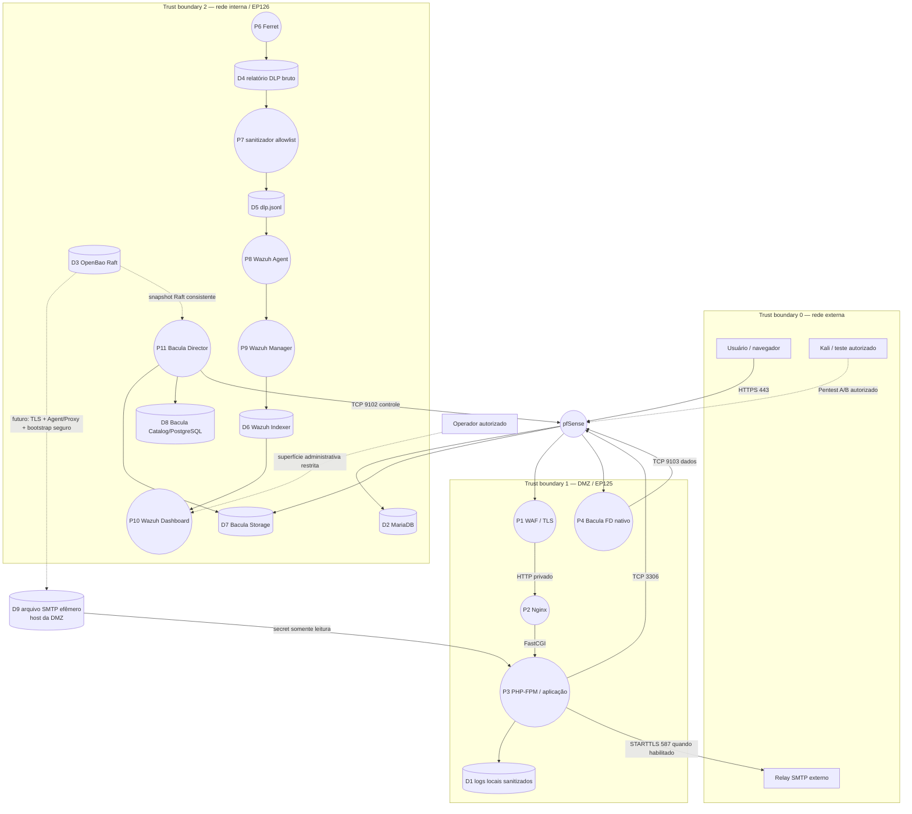

# DFD — ConectaEduca pós-VMs

**Objetivo:** representar fluxos de dados, processos e trust boundaries da arquitetura atual.

**Escopo:** aplicação, DMZ, rede interna, observabilidade, segredos, backup e serviços externos.

Um DFD não substitui o diagrama de rede. Ele evidencia **quem produz/consome dados, por qual fronteira eles passam e quais dados não devem atravessar determinadas superfícies**.

## DFD nível 0

## DFD nível 1

## Fluxos e classificação

| ID | Origem → destino | Dado | Fronteira | Controle principal | Resultado/estado |
|---|---|---|---|---|---|
| F-01 | navegador → WAF | requisição HTTPS | externa→DMZ | TLS + CRS | entrada web prevista |
| F-02 | WAF → Nginx → PHP | HTTP/FastCGI interno | Docker DMZ | redes privadas, sem binding direto | backend não exposto |
| F-03 | PHP → MariaDB | consultas/dados da aplicação | DMZ→interna | pfSense + bind DB + credencial | TCP/3306 alcançável no teste |
| F-04 | arquivo efêmero do host DMZ → PHP | segredo SMTP | host DMZ→workload | arquivo fora do Git, permissões restritivas, secret somente leitura | contrato de consumo definido; integração OpenBao cross-VM ainda não habilitada |
| F-05 | PHP → relay SMTP | mensagem de recuperação | DMZ→externo | STARTTLS/autenticação | habilitado conforme runtime |
| F-06 | Ferret → relatório bruto | finding técnico | interna | filesystem restrito | não vai ao SIEM |
| F-07 | sanitizador → Wazuh Agent | evento DLP minimizado | interna | allowlist de campos | classificação Manager validada |
| F-08 | Agent EP125 → Manager | telemetria/FIM/YARA | DMZ→interna | TCP/1514 + regras Wazuh | fluxo operacional |
| F-09 | Director → FD EP125 | controle Bacula | interna→DMZ | TCP/9102 | alcançável no teste |
| F-10 | FD EP125 → Storage | dados de backup | DMZ→interna | TCP/9103 | alcançável no teste |
| F-11 | OpenBao → Bacula | snapshot Raft | interna | AppRole mínima + staging protegido | restore/hash validado em laboratório |
| F-12 | operador → Dashboard | administração SIEM | administrativa→interna | binding/rede restrita | não deve atravessar DMZ |
| F-13 | Kali → perímetro | probes/pentest | teste→arquitetura | escopo autorizado | pendente Pentest A/B |

## Dados que não devem atravessar determinadas fronteiras

Nunca encaminhar ao Wazuh como conteúdo normal:

- `reports/raw/` do Ferret;
- conteúdo original do arquivo analisado;
- senha;
- token;
- TOTP;
- recovery code;
- chave privada;
- unseal share;
- root token;
- dump SQL.

Nunca armazenar no Git:

- `.runtime/`;
- `.env` real;
- RoleID/SecretID reais;
- senha SMTP;
- credenciais Bacula/MariaDB/Wazuh;
- chaves privadas.

## Relação com STRIDE

O DFD fornece as trust boundaries usadas pelo threat model:

- **B0 → B1:** exposição web e ataques de aplicação/perímetro;
- **B1 → B2:** principal fronteira de movimento lateral;
- **runtime OpenBao → workload:** spoofing/elevação de privilégio de identidade;
- **Ferret → Wazuh:** risco de information disclosure por telemetria;
- **Bacula:** tampering/denial of service contra recuperabilidade;
- **administração:** elevação de privilégio e acesso indevido a superfícies internas.

Consulte `docs/stride.md` para o detalhamento das ameaças e `docs/plano-testes.md` para os casos de validação.
